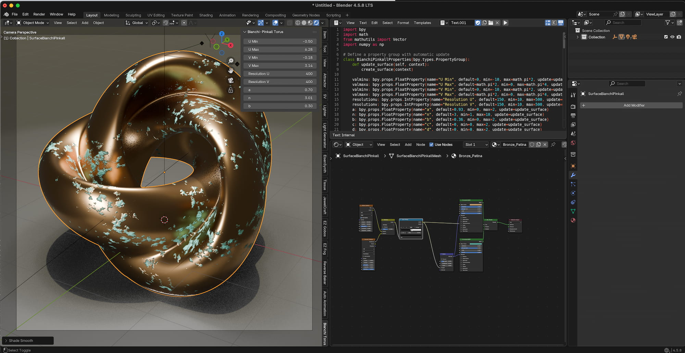

  

# Bianchi-Pinkall Flat Tori
A script to generate the Bianchi-Pinkall Flat Tori surface

# Symmetries
The Bianchi-Pinkall flat tori are special geometric surfaces shaped like donuts that are smoothly embedded into a three-dimensional sphere. They are uniquely constructed by lifting specific closed curves from a two-dimensional sphere using a mathematical mapping called the Hopf fibration.

# Screen Shot

  <a href="https://github.com/smice-art/Python-Scripts-Math-Objects/tree/main">
    <button style="cursor: pointer; padding: 10px 20px; font-weight: bold; background-color: #24292e; color: white; border: 1px solid rgba(27,31,35,.15); border-radius: 6px;">⬅️ Back to Main Overview</button>
  </a>

