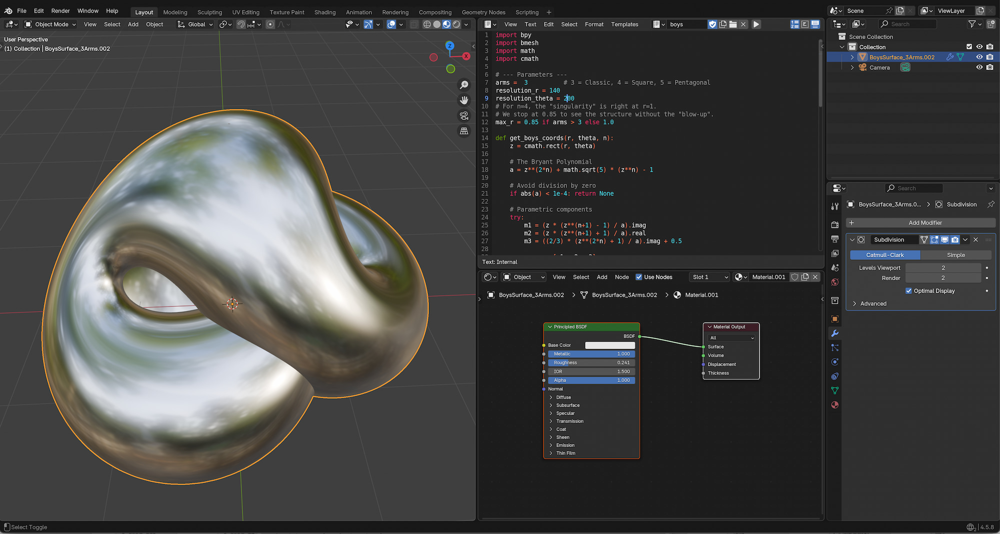

  

# Kusner-Bryant Surface
A script to generate the Kusner–Bryant parametrization of the Boy's surface

# Symmetries
Boy's surface has 3-fold symmetry. This means that it has an axis of discrete rotational symmetry: any 120° turn about this axis will leave the surface looking exactly the same. The Boy's surface can be cut into three mutually congruent pieces.

# Screen Shot

  <a href="../">
    <button style="cursor: pointer; padding: 10px 20px; font-weight: bold; background-color: #24292e; color: white; border: 1px solid rgba(27,31,35,.15); border-radius: 6px;">⬅️ Back to Main Overview</button>
  </a>

