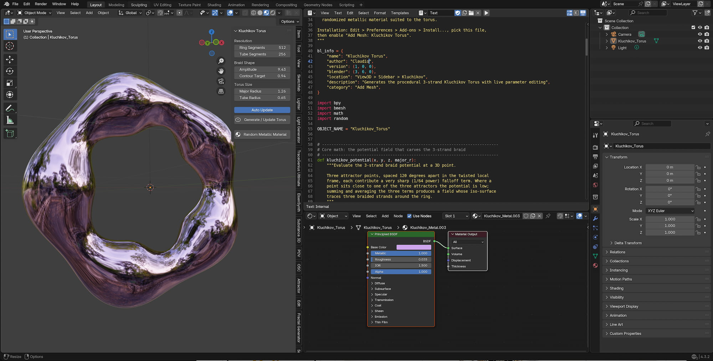

  

# Kluchikov Torus Surface
A script to generate the smooth Torus I found in this context often the Name "Kluchikov Torus", so i kept this name.

## Background
This add-on procedurally builds the "Kluchikov Torus" - a torus whose tube radius is not constant, but is displaced by a 3-strand potential field ("kluchikov_potential"). The field is built from three attractor points arranged 120 degrees apart around the tube's cross-section, combined with a slow twist that rotates 8/3 times per revolution around the main ring. Because the twist rate (8/3) and the 3-fold symmetry of the attractor points don't divide evenly, the three "lobes" braid around each other as they travel around the ring - producing a continuous, self-weaving triple-strand torus instead of a plain donut.

## What this script does

* An N-panel tab called "Kluchikov" (open the 3D Viewport sidebar with N) with all generation parameters.
* An "Auto Update" toggle: while enabled, dragging any slider regenerates the mesh live. While disabled, use the "Generate / Update Torus" button.
* A "Random Metallic Material" button that builds and assigns a shiny, randomized metallic material suited to the torus.

## Screen Shot

  <a href="https://github.com/smice-art/Python-Scripts-Math-Objects/tree/main">
    <button style="cursor: pointer; padding: 10px 20px; font-weight: bold; background-color: #24292e; color: white; border: 1px solid rgba(27,31,35,.15); border-radius: 6px;">⬅️ Back to Main Overview</button>
  </a>

