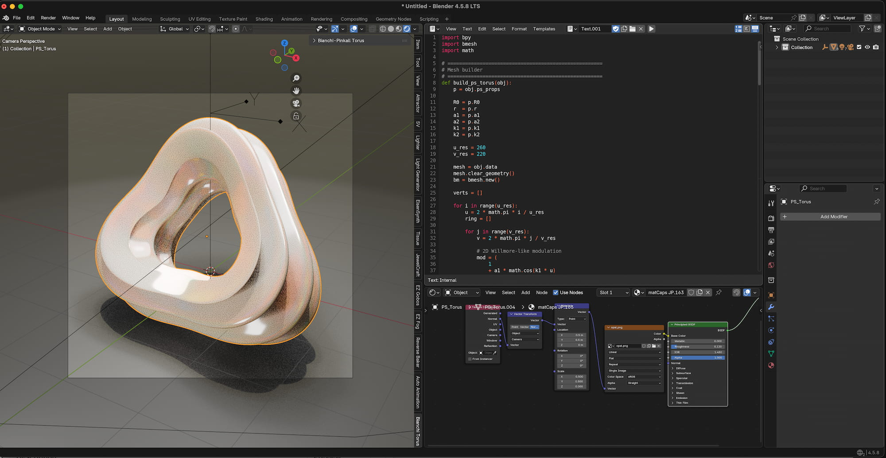

  

# Pinkall stereo torus surface
A script to generate the Pinkall stereo torus surface

# Symmetries
The Pinkall stereo torus is a specific geometric surface in three-dimensional space obtained by stereographically projecting a flat torus from the four-dimensional sphere. It is famous for being a Willmore surface, meaning it minimizes a specific type of bending energy called total curvature.

# Formula
The 3D Projected Coordinates (Stereographic Projection):
x = x1 / (1 - x4)
y = x2 / (1 - x4)
z = x3 / (1 - x4)
(Note: The variables u and v both range from 0 to 2 * pi).

# Screen Shot

  <a href="https://github.com/smice-art/Python-Scripts-Math-Objects/tree/main">
    <button style="cursor: pointer; padding: 10px 20px; font-weight: bold; background-color: #24292e; color: white; border: 1px solid rgba(27,31,35,.15); border-radius: 6px;">⬅️ Back to Main Overview</button>
  </a>

