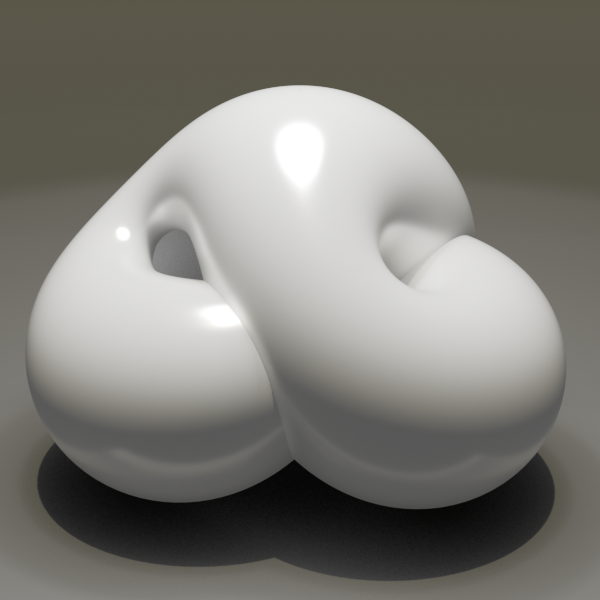
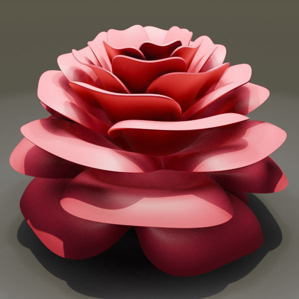
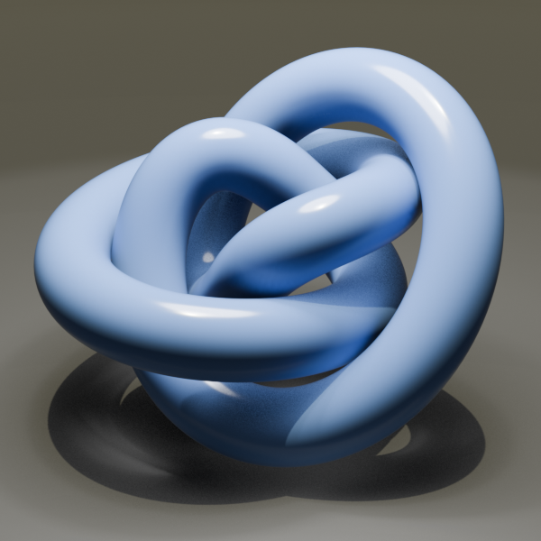
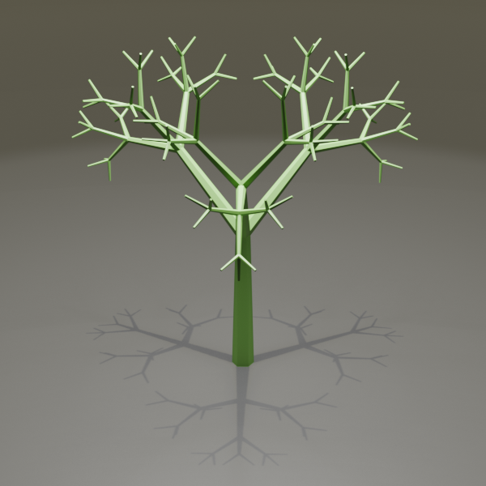
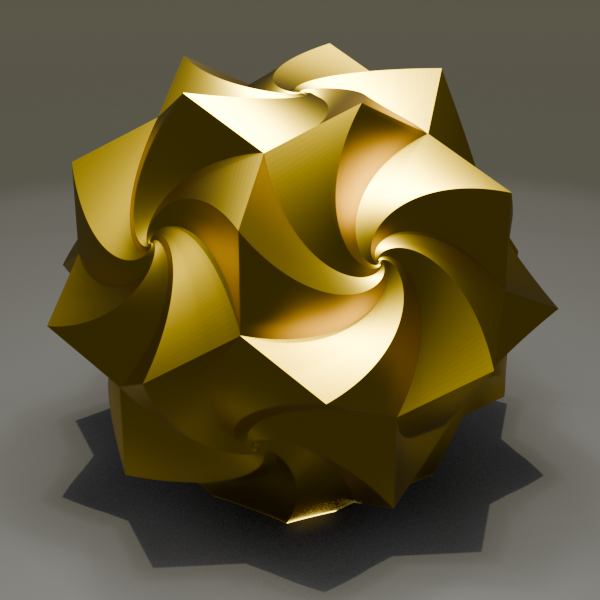
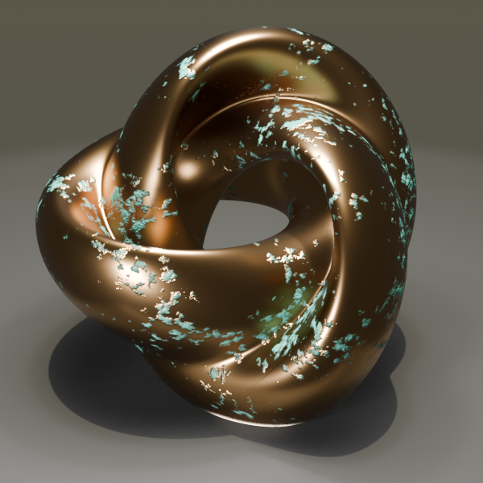
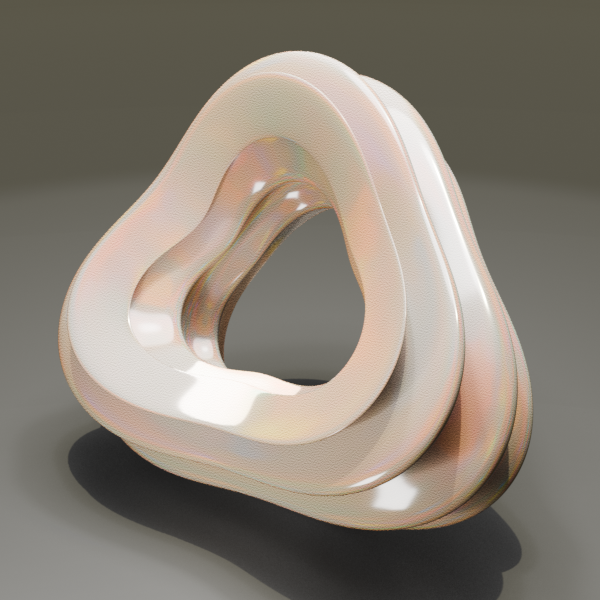
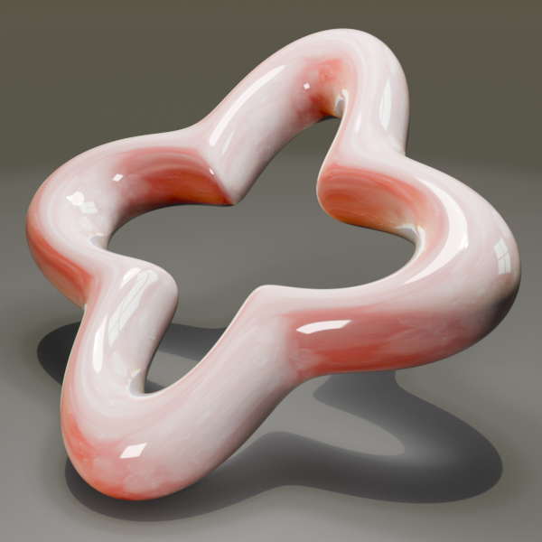
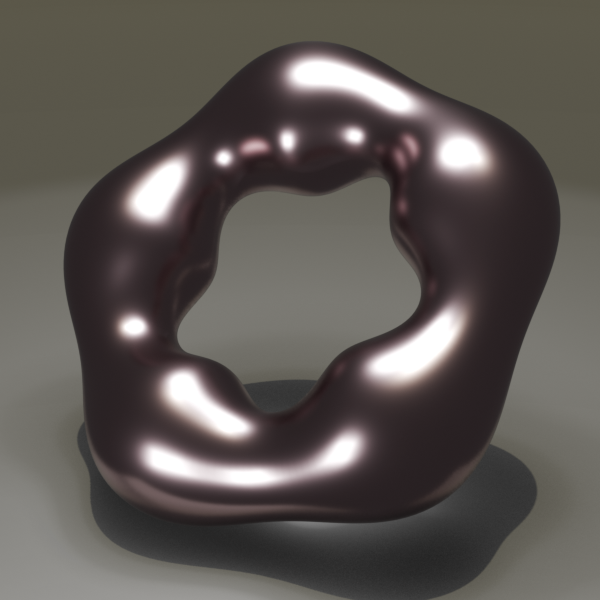

<link rel="stylesheet" href="css/style.css">

  

# Python Scripts Math Objects Volume I
A collection of Python Scripts to generate Math Objects in Blender. All those objects are generated with python script inside Blender. To use them just copy and paste the code inside the text environment in Blender and run the script. Most scripts have a "parameter" area, where it is possible to adjust the look of the objects. 

## 📂 Phyton-Scripts

Here is the table of Blender Scripts with a small preview:

| Object | Description | Preview |
| :--- | :--- | :--- |
| **[BOYS](./Boys/)** | Boy's Surface (Bryant-Kusner). |  |
| **[BOYS](./Boys/)** | Boy's Surface (Bryant-Kusner). |  |
| **[ROSE](./Rose/)** | Just a simple python Flower. |  |
| **[KNOT](./Twisted-Knot/)** | A braided knot is an interwoven, closed, non-self-intersecting curve in 3D. |  |
| **[TREE](./Tree/)** | A fractal tree is an infinitely repeating geometric pattern that mimics the branching structure. |  |
| **[SPIRO](./Spiro/)** | A spidrohedron (sometimes also called a spidron polyhedron) is a complex geometric solid whose surfaces are made up of so-called spidrons. |  |
| **[BIANCHI](./Bianchi/)** | Bianchi-Pinkall Flat Tori. |  |
| **[PINKALL](./Pinkall/)** | The Pinkall stereo torus is a specific geometric surface . |  |
| **[WILLMORE](./Willmore/)** | Willmore Torus 4 Lobed Surface. |  |
| **[KLUCHIKOV](./Kluchikov/)** | Kluchikov Torus. |  |
