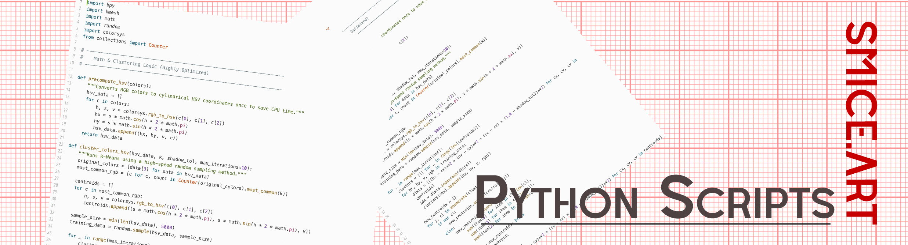
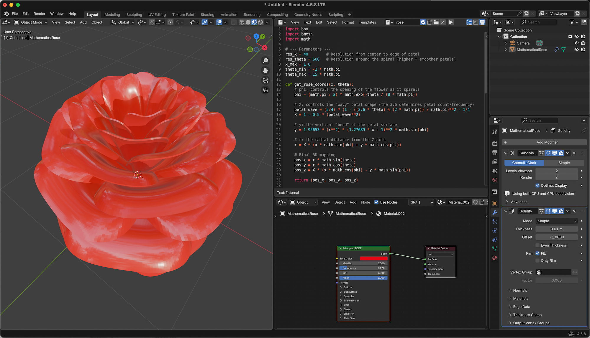

  

# Rose
A Rose, made with pur Python

# Screen Shot

  <a href="https://github.com/smice-art/Python-Scripts-Math-Objects/tree/main">
    <button style="cursor: pointer; padding: 10px 20px; font-weight: bold; background-color: #24292e; color: white; border: 1px solid rgba(27,31,35,.15); border-radius: 6px;">⬅️ Back to Main Overview</button>
  </a>

