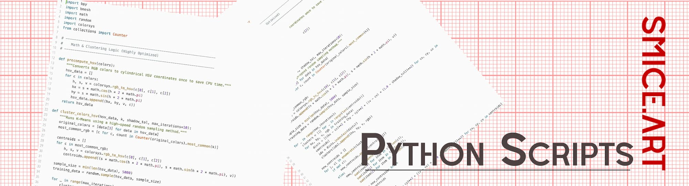
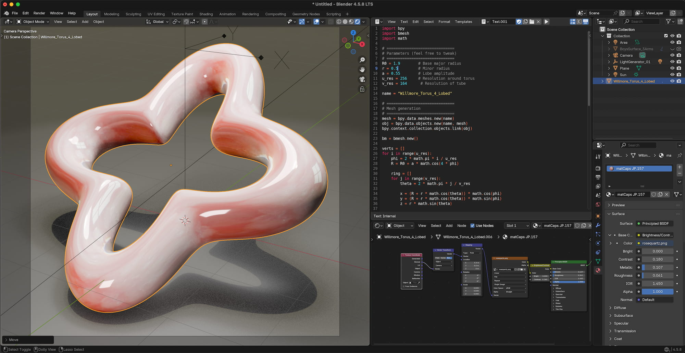

  

# Willmore Torus 4 Lobed Surface
A script to generate the Willmore Torus surface

# Symmetries
The 4-lobed Willmore torus is an unstable critical point of the Willmore energy functional featuring four symmetric, bulbous ripples or lobes. It is constructed by lifting a closed elastic curve with specific winding symmetries from a 2-sphere into four-dimensional space via the Hopf fibration before stereographically projecting it down into 3D.

# Screen Shot

  <a href="https://github.com/smice-art/Python-Scripts-Math-Objects/tree/main">
    <button style="cursor: pointer; padding: 10px 20px; font-weight: bold; background-color: #24292e; color: white; border: 1px solid rgba(27,31,35,.15); border-radius: 6px;">⬅️ Back to Main Overview</button>
  </a>

